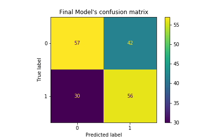

# Saved Models

This subfolder contains models, data points and labels, saved through running `../euromillions.ipynb`.
These can be loaded in using `Python`'s `pickle` library.
They are primarily used by the `../quickstart.py` script to make predictions on user inputs.

# Files

- `soft-vote-model.sav`: The soft-voting classifier used for the final prediction
- `saved-dataset.sav`: The fully cleaned euromillions dataset
- `model-labels.sav`: The model labels which are used by the soft-voting classifier to make predictions.

# Current up-to-date model

Soft-voting model with Random Forest, C-SVM and XGBoost. Date: 26. 06. 2023

It's confusion matrix can be found below:

